<p align="center">
  <strong>English</strong> · <a href="README.zh-CN.md">简体中文</a>
</p>

<p align="center">
  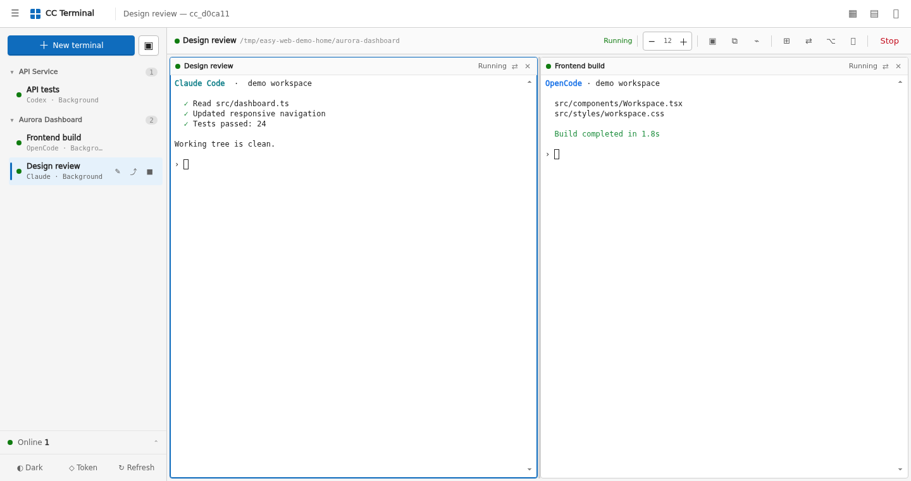
</p>

<h1 align="center">Easy Web Vibecoding</h1>

<p align="center">
  <strong>A persistent, split-screen web workspace for Claude Code, Codex, OpenCode, and your shell.</strong>
</p>

<p align="center">
  <a href="https://github.com/DarranLiu/Easy-Web-Vibecoding/actions/workflows/tests.yml"></a>
  <a href="https://github.com/DarranLiu/Easy-Web-Vibecoding/releases"></a>
  <a href="LICENSE"></a>
  
  
</p>

<p align="center">
  <strong>4</strong> terminal types · up to <strong>4</strong> panes · persistent tmux sessions · files and resource monitoring · desktop and mobile
</p>

Easy Web Vibecoding turns command-line coding agents already installed on your Linux server into a browser workspace. Its interface is called **CC Terminal**. It is not a model proxy and it does not relay model API traffic: `tmux + FastAPI + xterm.js` connect your browser to the real terminal process.

Close the tab, lose the network, or restart the web service. The job remains in tmux and can be resumed when you return.

> [!NOTE]
> Every screenshot below comes from the real interface rendered in a browser. Sessions, paths, IP addresses, files, and hardware data are synthetic and do not identify a real server.

## Quick start

**Linux or another Unix-like server**

```bash
git clone https://github.com/DarranLiu/Easy-Web-Vibecoding.git
cd Easy-Web-Vibecoding

export CC_WEB_ROOTS="$HOME/projects"
export CC_WEB_DEFAULT_DIR="$HOME/projects"
./run.sh
```

The first run creates `.venv`, installs the Python dependencies, and generates a random access token. An interactive launch prints the token to the terminal. A non-interactive launch stores it in `~/.cc-web-token` with mode `0600`, keeping it out of service logs.

By default the server only listens on:

```text
http://127.0.0.1:8000
```

The host needs Python 3.10+ and `tmux`. Install and sign in to Claude Code, Codex, or OpenCode separately; this project does not store their API keys. Read the [deployment guide](docs/DEPLOYMENT.en.md) before exposing it through a reverse proxy or tunnel.

## Visual tour

### Start the right tool in the right directory

Choose a project, then launch a new Claude session, resume Claude, start Codex, OpenCode, or a normal shell. Tools that are not installed are omitted instead of becoming broken menu items.

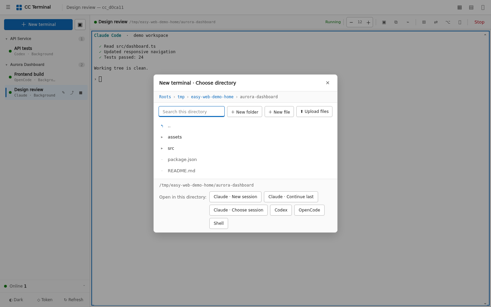

### Work in up to four panes

Each tab owns an independent tmux session. Arrange terminals side by side, stacked, or automatically; drag the divider, swap panes, and switch tabs without stopping the underlying task.


### Copy terminal output without breaking Ctrl+C

Select text and use the copy button, `Ctrl+Shift+C` on Windows/Linux, or `Cmd+C` on macOS/iPad. Plain `Ctrl+C` still sends an interrupt. Selection mode makes mouse-driven TUIs easier to copy from, and a long press or right click copies full scrollback.

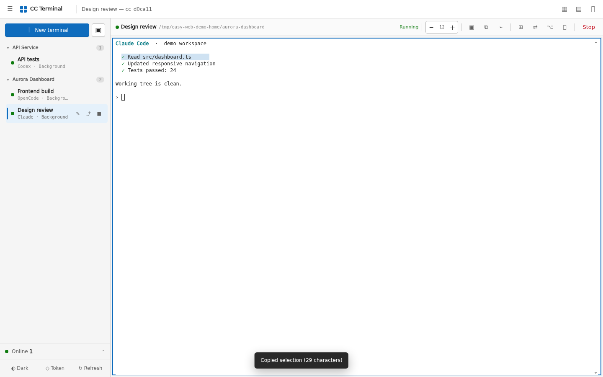

Text pastes directly into the focused terminal. The image action accepts a file, a clipboard screenshot, or drag and drop. It saves the image under `.cc-web-images/` in the working directory and inserts the path into the terminal instead of pushing binary data through the PTY.

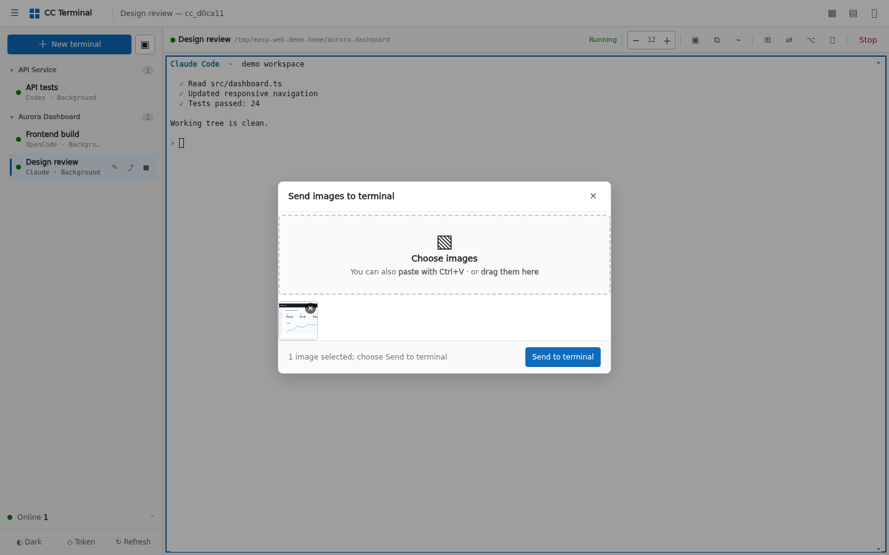

### Manage and preview project files

Browse, filter, upload, download, create, rename, and delete files inside the `CC_WEB_ROOTS` allowlist.

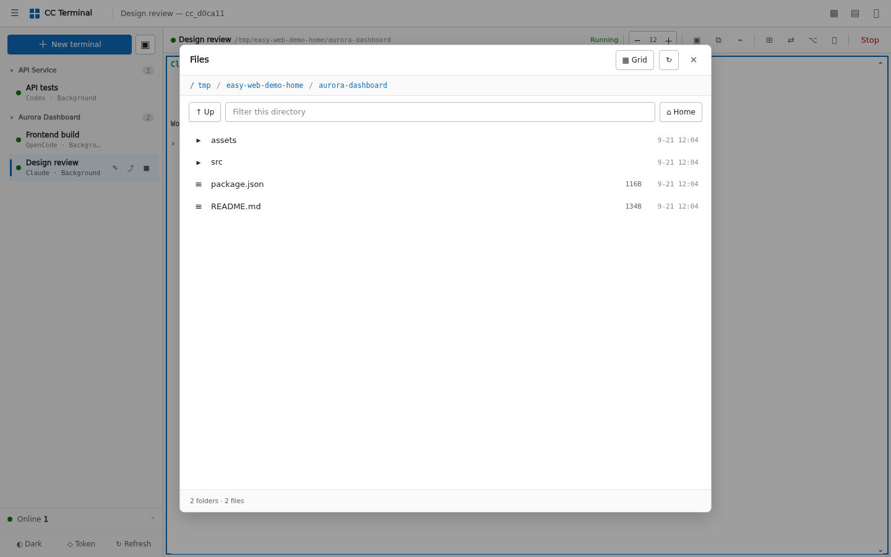

Preview common text, image, video, audio, and PDF files without opening a remote desktop.

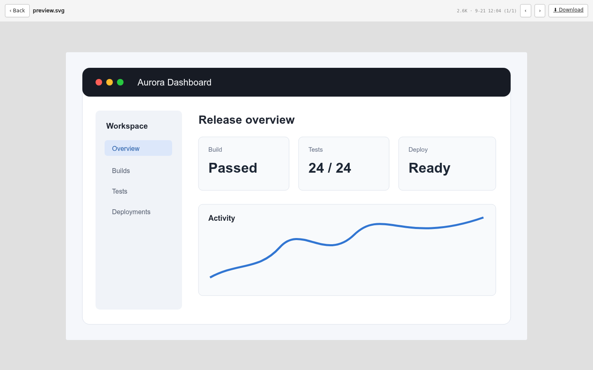

### Monitor the machine without leaking command lines

The resource panel shows GPU memory, utilization, temperature, power, user, and process name. It deliberately omits full process arguments, where tokens and private paths often appear. Remote GPU hosts can be queried over key-based SSH.

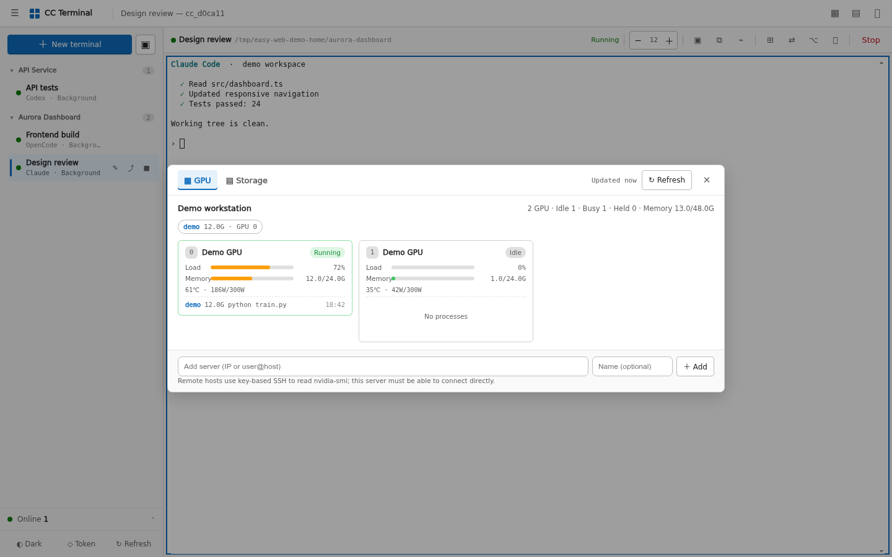

Storage starts with filesystem capacity and drills down into directory usage. Slow `du` scans run in the backend and are cached.

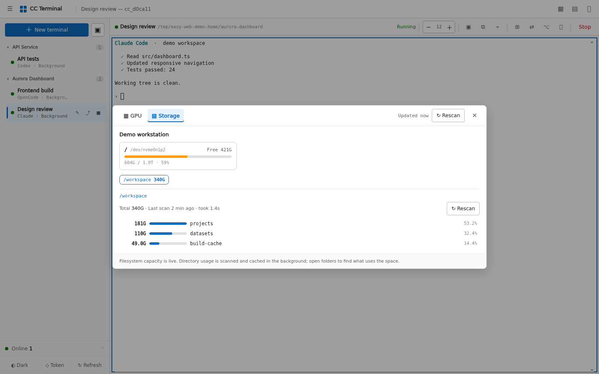

### Recognize connected devices

The current release uses one shared token, not a multi-tenant account system. The connection view records authenticated source IPs, device classes, first/last seen times, and visit counts. You can add a note, flag an unfamiliar source, or remove a record.

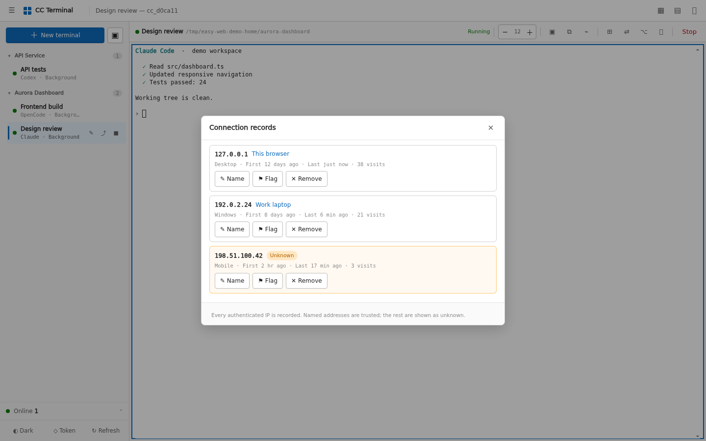

### Keep Codex usage subtle

Only the focused Codex pane shows its remaining percentage and reset time. Hidden tabs and other tools do not poll. Multiple entry points share a cache and file lock, so the server reads usage at most once every ten minutes.

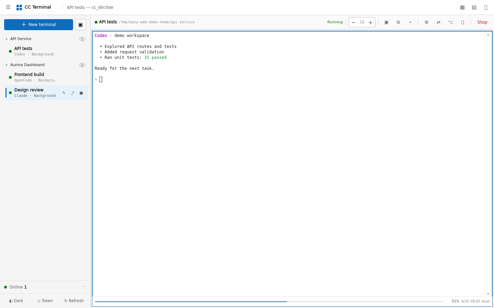

### Use it from a phone

The mobile layout keeps practical terminal keys such as `Esc`, `Tab`, `Ctrl`, and arrows. Visual Viewport resizing keeps the cursor above the software keyboard.

<p align="center">
  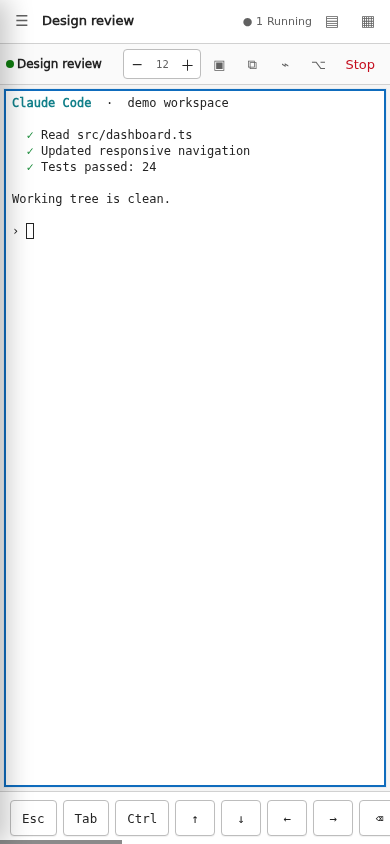
</p>

## Details that matter in daily use

- Browser disconnects detach the tmux client; they do not terminate the job.
- The wheel enters tmux history in a normal shell and stays available to full-screen Claude/Codex-style TUIs.
- Bundled terminal fonts reduce missing symbols and alignment problems on Windows clients.
- IME composition is handled as composition, avoiding broken Chinese/Japanese/Korean input.
- Light, dark, high-contrast, reduced-motion, and installable PWA layouts are supported.
- API responses and file previews use `Cache-Control: no-store`.

The [visual guide](docs/VISUAL_GUIDE.md) covers each workflow step by step. The [problems solved](docs/PROBLEMS_SOLVED.en.md) document explains the terminal, input, reconnect, font, and usage-meter issues behind these choices. The visual guide is currently in Chinese; its screenshots and controls match the interface.

## Architecture

```text
Browser / xterm.js
       │ WebSocket
       ▼
FastAPI backend ── attach ── tmux session ── Claude / Codex / OpenCode / Shell
       │
       └── file, resource, presence, and usage REST APIs
```

The core rule is simple: **a browser connection is not the terminal process**.

## Configuration

| Variable | Default | Purpose |
| --- | --- | --- |
| `CC_WEB_HOST` | `127.0.0.1` | Listen address. Do not expose the app directly to the public internet. |
| `CC_WEB_PORT` | `8000` | Listen port. |
| `CC_WEB_AUTH` | `1` | Token authentication. Disable only for local testing. |
| `CC_WEB_TOKEN` | Random on first launch | Shared access token; use a long random value. |
| `CC_WEB_ROOTS` | Current user's home | Comma-separated allowlist for file APIs. |
| `CC_WEB_DEFAULT_DIR` | Current user's home | Initial directory for new terminals. |
| `CC_WEB_CLAUDE` | Auto-detected | Path to the `claude` executable. |
| `CC_WEB_CODEX` | Auto-detected | Path to the `codex` executable. |
| `CC_WEB_OPENCODE` | Auto-detected | Path to the `opencode` executable. |
| `CC_WEB_DISK_ROOTS` | Current user's home | Directories the resource panel may scan with `du`. |

See [deployment and configuration](docs/DEPLOYMENT.en.md) for every variable plus systemd and Caddy examples.

## Security model

This is a remote terminal. Anyone with access can generally act with the permissions of the service account, so protect it like SSH.

- Keep `CC_WEB_AUTH=1`.
- Use HTTPS plus an identity-aware proxy, VPN, or source allowlist for internet access.
- Restrict `CC_WEB_ROOTS`; do not casually set it to `/`.
- Share the token only with trusted operators. There are no per-user roles or read-only guests yet.
- Never commit `.env`, tokens, certificates, logs, state JSON, or real deployment screenshots.

Authentication exchanges the master token for a server-signed, time-limited HttpOnly and SameSite session cookie; the raw token is not stored in the browser. Tokens are kept out of download links, WebSocket URLs, browser history, and default access logs. Runtime state files use mode `0600`. Read the complete [security policy](SECURITY.md) and report vulnerabilities privately.

## Test

```bash
python3 -m unittest discover -s tests -v
node --check frontend/app.js
bash -n run.sh
```

## Contributing and support

Bug reports, focused pull requests, and tested interaction improvements are welcome. Start with [CONTRIBUTING.md](CONTRIBUTING.md), use [GitHub Discussions](https://github.com/DarranLiu/Easy-Web-Vibecoding/discussions) for questions, and follow the [Code of Conduct](CODE_OF_CONDUCT.md).

If this project makes a remote coding workflow easier, a GitHub star helps other developers find it.

## License and project identity

The source code is available under the [MIT License](LICENSE). Bundled xterm.js files and DejaVu fonts retain their upstream licenses; see [THIRD_PARTY_NOTICES.md](THIRD_PARTY_NOTICES.md). MIT covers the code, not an implied right to present a modified project as the official Easy Web Vibecoding distribution; see [TRADEMARKS.md](TRADEMARKS.md).
