# 可视化操作手册

这份手册按真正的操作顺序写，不要求先理解 tmux、PTY 或 WebSocket。

所有截图来自项目真实前端。会话名称、目录、文件、IP 和资源数据均为匿名演示内容。

## 1. 新建终端

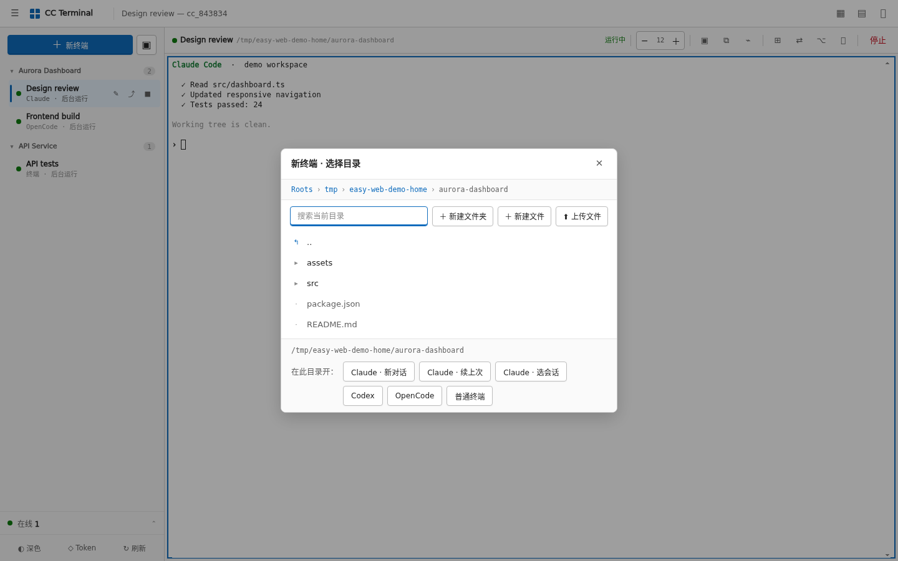

1. 点左上角“新终端”。
2. 在目录选择器里进入项目目录，也可以用搜索过滤当前目录。
3. 选择 Claude 新对话、继续最近对话、会话选择器、Codex、OpenCode 或普通终端。
4. 新标签会出现在左侧，并自动接入工作区。

某个 AI CLI 没有安装时，对应按钮会隐藏。目录只能落在 `CC_WEB_ROOTS` 中。

## 2. 恢复和停止会话

左侧绿色圆点表示 tmux 会话仍在运行，灰色表示已停止。

- 点运行中的标签：重新接入，不会重启程序。
- 点停止按钮：终止 tmux session，但保留标签和目录信息。
- 点已停止标签的恢复按钮：在原目录重新启动同类终端。
- 删除标签：如果会话还在运行，会先停止再删除记录。

停止和删除属于破坏性操作，界面会要求确认。

## 3. 分屏工作

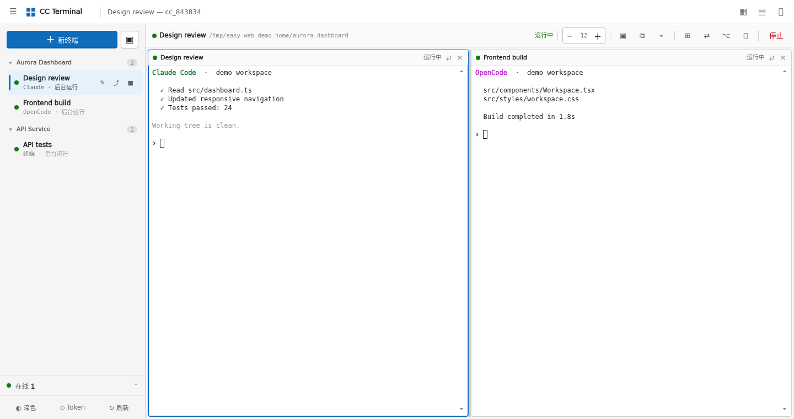

1. 先打开一个会话。
2. 使用顶部布局按钮新增分屏，或从侧栏把另一个会话放入空白格。
3. 点击某一格即可让顶部命令作用于它。
4. 拖动分隔线调整大小；拖动格子的标题栏可以交换位置。

最多同时四格。每格都有独立 WebSocket，某一格重连不会重建其它终端。

## 4. 滚动终端历史

- 普通 Shell：鼠标滚轮和触摸滑动驱动 tmux copy-mode，可以查看服务器端历史。
- Claude、Codex、OpenCode 等全屏 TUI：滚轮事件交给应用自己。
- 回到输入时，普通键盘输入会退出 tmux 历史浏览。

历史保存在 tmux 中，因此换浏览器或重新连接后仍然存在。

## 5. 选择和复制文字

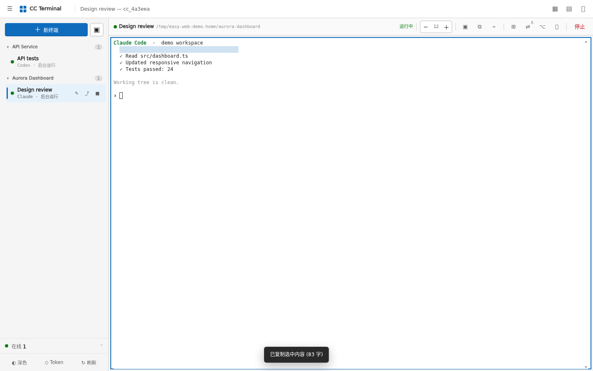

1. 普通终端直接拖动选择文字。
2. 如果 AI TUI 接管了鼠标，先点顶部“选择模式”，再拖动。
3. 点复制按钮，或使用 Windows / Linux 的 `Ctrl+Shift+C`、macOS / iPad 的 `Cmd+C`。

复制按钮还有两种行为：

- 没有选区：复制当前屏幕。
- 长按或右键：复制完整终端历史。

普通 `Ctrl+C` 始终保留给终端发送中断信号。

## 6. 粘贴普通文字

点击终端让它获得焦点，然后：

- Windows / Linux：`Ctrl+V`
- macOS：`Cmd+V`
- 手机和平板：使用系统输入菜单中的“粘贴”

普通文字直接进入当前终端，不经过额外弹窗。

## 7. 粘贴、选择或拖入图片

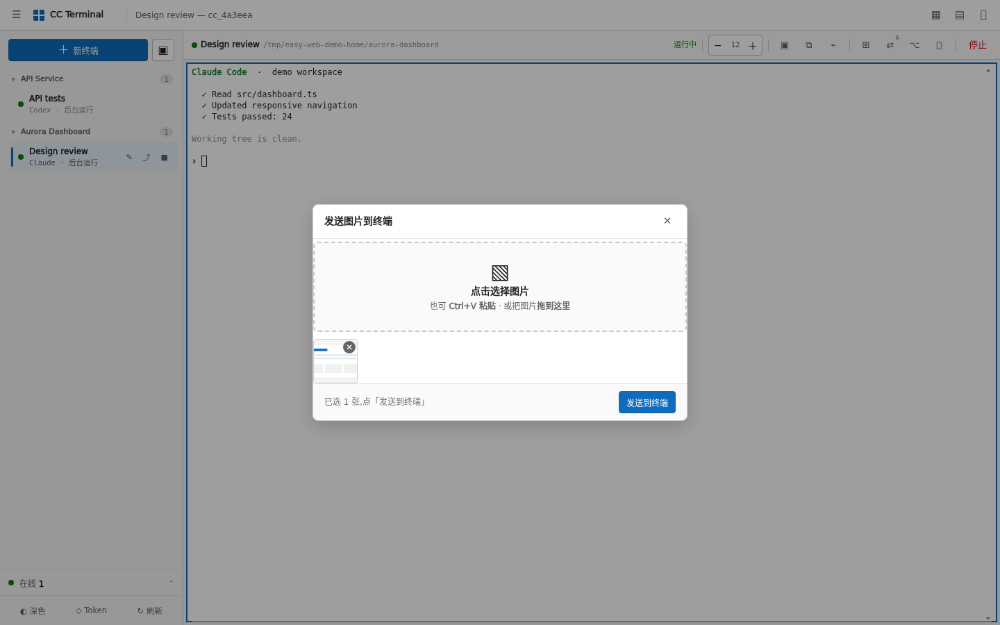

1. 点顶部图片按钮。
2. 点击选择图片，或在窗口中按 `Ctrl+V` 粘贴截图，也可以把图片拖进虚线区域。
3. 缩略图出现后，可以继续加图或点右上角移除。
4. 点“发送到终端”。
5. 图片路径会出现在当前输入位置，补一句要求后按回车。

图片实际保存到当前工作目录的 `.cc-web-images/`。这是普通文件，AI CLI 是否读取它取决于该工具本身的能力。

## 8. 浏览和管理文件

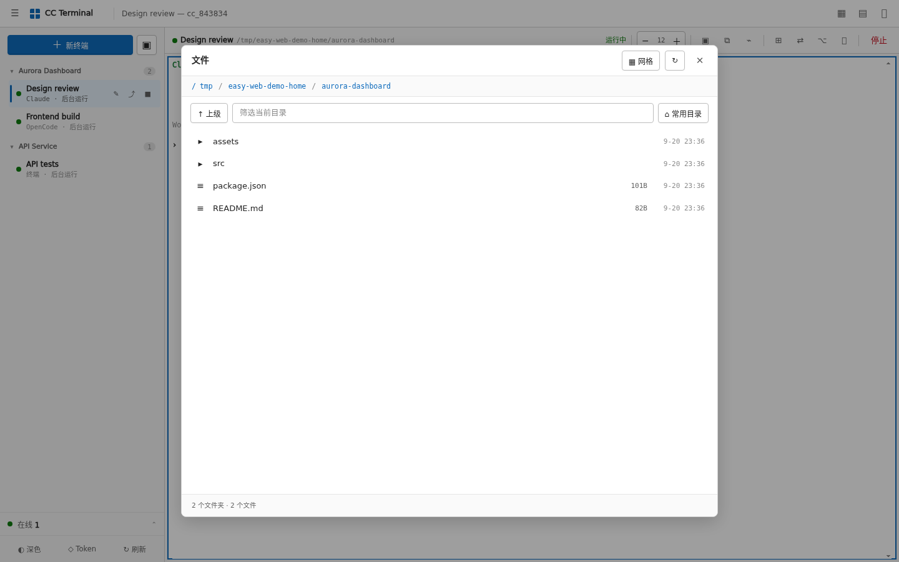

从顶部文件按钮打开文件面板：

- 点击目录进入，面包屑可以快速返回上层。
- 搜索框只过滤当前目录。
- 列表与网格视图可以切换。
- 支持新建文件夹、新建文件、上传、下载、改名和删除。

这些操作都在服务端执行，因此权限与运行 Web 后端的系统用户相同。

## 9. 预览文件

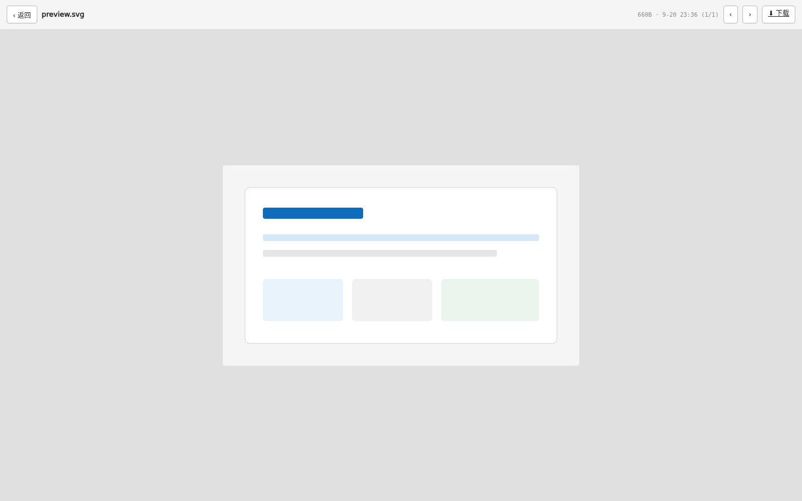

点击文件即可打开预览：

- 图片：自适应缩放。
- 视频/音频：浏览器原生播放器。
- PDF：内嵌阅读。
- 文本和代码：最多读取前 512 KB，避免大文件拖垮页面。

顶部的前后按钮在当前目录的可预览文件之间切换，下载按钮始终获取原文件。

## 10. 查看 GPU

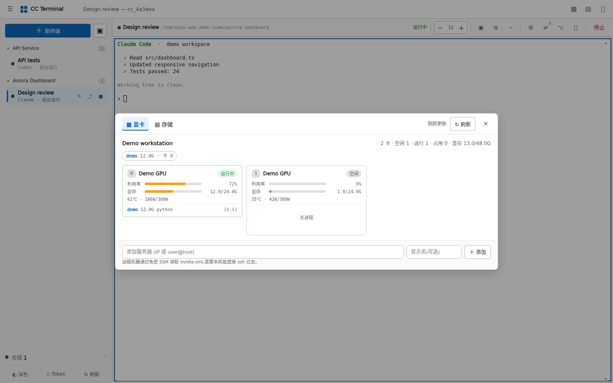

资源面板的“显卡”页会显示：

- GPU 数量与空闲/运行状态
- 利用率、显存、温度和功耗
- 占用用户、进程名与运行时长；完整命令参数不会被采集

远程主机使用当前服务用户的免密 SSH 读取 `nvidia-smi`。只应添加可信主机。

## 11. 查看磁盘与目录占用

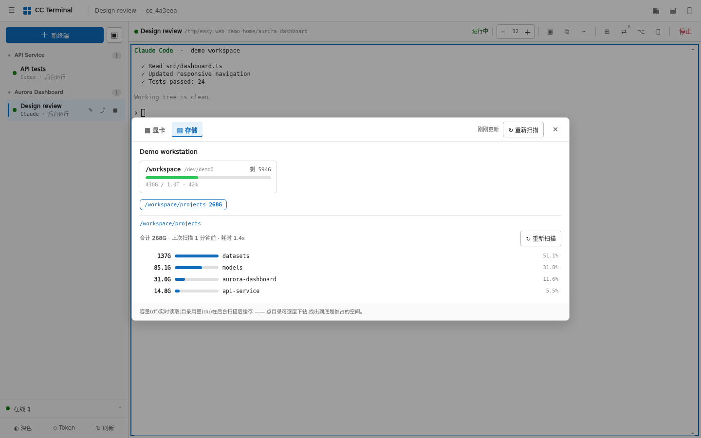

1. 切到“存储”。
2. 先看分区总量、已用、剩余和百分比。
3. 选择允许扫描的根目录。
4. 点击子目录继续下钻，找出空间主要花在哪里。
5. 数据过旧时点“重新扫描”。

容量由 `df` 实时读取；目录大小由后端运行 `du` 后缓存。允许扫描的范围由 `CC_WEB_DISK_ROOTS` 决定。

## 12. 查看连接与 IP 记录

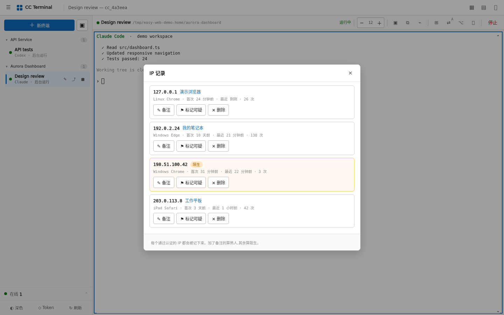

左下角“在线”显示当前页面数量。打开后可以看实时连接，再进入“IP 记录 / 熟人名单”查看历史。

- 备注：给认识的来源命名，并标记为熟人。
- 标记可疑：保留记录并突出显示。
- 删除：忘记这条记录；下次出现时会重新视为陌生。

这里管理的是连接来源，不是用户账号。当前版本仍是共享 Token，没有用户、角色或目录级权限分配。

来源 IP、设备类型、首次和最近出现时间会保存在服务端权限为 `0600` 的状态文件中。记录可以在这里逐条删除；所有持有共享 Token 的操作者都能看到这些连接信息。

示例中的 `192.0.2.0/24`、`198.51.100.0/24`、`203.0.113.0/24` 都是文档专用网段。

## 13. 查看 Codex 用量

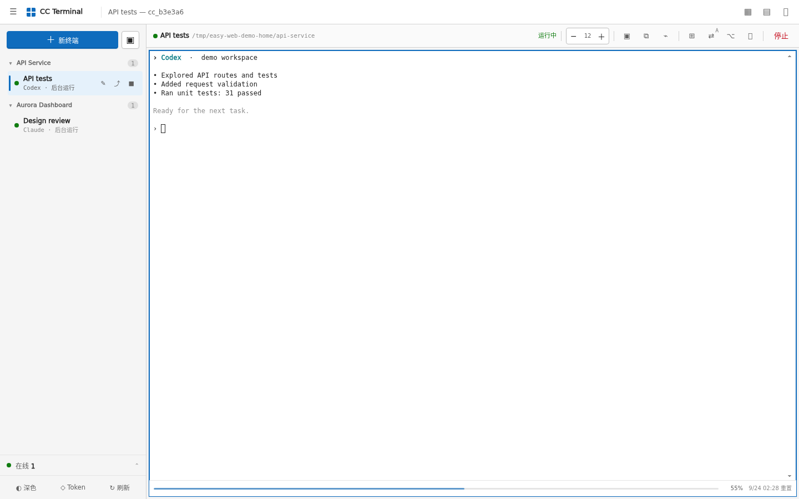

当前聚焦 Codex 时，窗口底部显示剩余百分比和重置时间。用量栏不会占用终端行数。

前端只为可见且聚焦的 Codex 窗口调度查询；服务端使用共享文件锁与缓存，把实际读取频率限制为最多每 10 分钟一次。

## 14. 手机上操作

  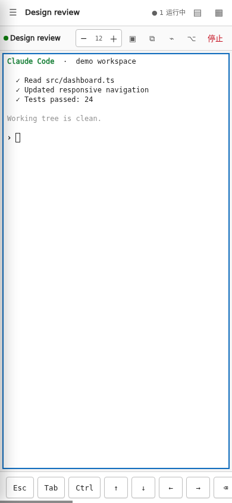

底部辅助键提供 `Esc`、`Tab`、`Ctrl` 和方向键。键盘按钮可手动展开或收起软键盘；输入法弹出后，终端会重新计算可用高度。

手机上的触摸滑动仍遵循与桌面滚轮相同的历史路由；打开选择模式后，触摸拖动改为选择文字。

## 15. 断线后发生什么

WebSocket 断开时，后端只关闭当前 PTY attach。tmux session 和里面的 AI 任务继续运行。

重新打开页面后：

1. 标签从状态文件恢复。
2. 后端检查对应 tmux session 是否仍在。
3. 浏览器重新 attach。
4. 终端尺寸与当前窗口重新同步。

因此“刷新页面”和“停止任务”是两件完全不同的事。
