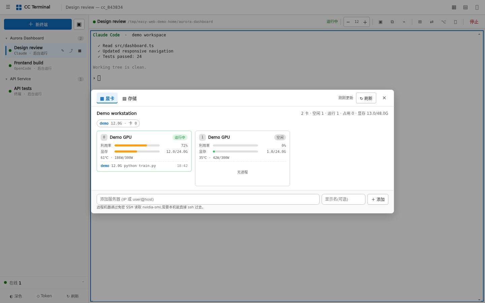

# 可视化操作手册

这里的截图来自项目真实前端和真实浏览器渲染，但会话名称、目录、终端输出、IP 和资源数据全部使用演示内容，不对应任何真实服务器。

## 桌面工作区

左侧是会话列表，右侧是当前工作区。每个会话背后都是一个 tmux session，所以切换页面或刷新浏览器不会结束任务。

分屏时最多同时放四个终端。点某一格以后，顶部的复制、图片、停止、字号等操作都会作用于当前格。分隔线可以拖动，标题栏也可以拖到另一格交换位置。

## 手机上继续操作

手机布局保留了最常用的命令，并在底部提供 `Esc`、`Tab`、`Ctrl` 和方向键。软键盘弹出时，终端会重新计算可用高度，避免输入位置被挡住。

## 新建终端

选择目录后，可以直接启动：

- Claude 新对话、继续最近对话或打开会话选择器
- Codex
- OpenCode
- 普通 Shell

某种工具没有安装时，对应按钮会自动隐藏，不会出现“点了以后才报错”的假入口。

## 文件管理

文件面板支持列表/网格、搜索、上传、下载、改名、删除，以及图片、视频、音频、PDF 和文本预览。所有路径都必须落在 `CC_WEB_ROOTS` 中。

## 资源面板

资源面板可以看磁盘容量、目录占用和 NVIDIA GPU。远程主机通过免密 SSH 读取，不需要在远端安装本项目。

## Codex 用量

当前聚焦的是 Codex 时，终端底部会出现一条很轻的剩余额度条，只显示百分比和重置时间。后台标签、其它分屏和其它工具不会重复读取。

HTTP 与 HTTPS 后端共用一把文件锁和同一份缓存，服务端最多每 10 分钟向 Codex App Server 做一次只读查询。
